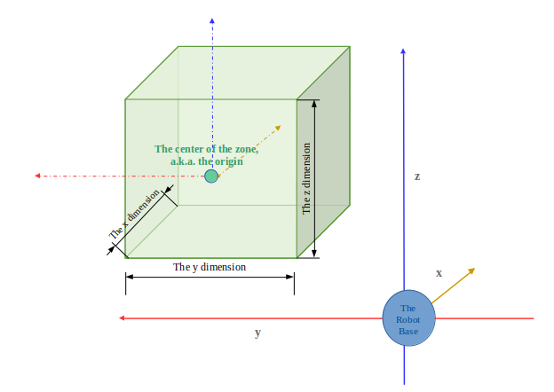

# Kinova Control
This package can be used to control a Kinova robot arm with Kortex, e.g. [Gen3](https://www.kinovarobotics.com/en/knowledge-hub/gen3-ultra-lightweight-robot). 
## Dependencies
1. [ROS Kinetic](http://wiki.ros.org/kinetic/Installation).
2. Install the [ROS Kortex package](https://github.com/Kinovarobotics/ros_kortex) in your catkin workspace.
## Usage
#### kinova_driver.py
This file contains functions that control the movements of the end-effector. There are three different sections in this
file: the gripper movement section, the cartesian mode movement section, and the joint mode movement section. This part 
of the package allows:
* Open and close the fingers
* Move the end-effector in a three-dimensional cartesian space, either via inputting the amount of displacement or by 
inputting the desired cartesian pose
* Get the current cartesian pose with respect to the base
* Change the pose of the robot by changing the joint angles

**1.** **Cartesian Pose**

A Cartesian pose is specified by the floats `x, y, z, theta_x, theta_y, theta_z`. If you are not 
certain about the exact values, you can use `kinova_read_cartesian.py` to find out the 
Cartesian pose of your desired position.

**2. Joint Angles**

A pose in terms of joint angles is a collection of actuator joint angles. If you are not sure about 
the exact values, you can run `rostopic echo /base_feedback` and look at the "position" 
sections.

#### kinova_protection_zone.py
This file contains functions related to Kinova robots' protection zone functionality. 
The functions in this file can:
* Create a protection zone
* Delete a protection zone specified by the ProtectionZoneHandle
* Update a protection zone
* Get the current protection zone state

**1. Protection Zone**

A protection zone for a Kinova robot is a pre-defined volume of the cartesian space where the robot's 
end-effector will not enter. According to the Kotex API, a Protection Zone is made up of:
* `handle`: the *ProtectionZoneHandle* that helps identify the protection zone
* `name`: a string
* `application_data`: reserved for the Web API use only
* `is_enabled`: a boolean that indicates if the protection zone is enabled; multiple protection zones can be 
enabled at the same time
* `shape`: a *ZoneShape* that specifies the shape of the protection zone
* `limitations`: list of *CartesianLimitation* that specifies the force, acceleration or velocity limits within 
the protection zone
* `envelope_limitations`: list of *CartesianLimitation* that specifies the force, acceleration or velocity limits 
inside the envelope

**2. Zone Shape**

A *ZoneShape* defines the position and dimension of a *ProtectionZone*. A *ZoneShape* instance is made of:
* `shape_type`: an enum; 0 - unspecified, 1 - cylinder, 2 - sphere, 3 - rectangular prism
* `origin`: the origin *Point* defined by its x, y, and z; this is the **center** of the zone
* `orientation`: a rotation matrix that specifies the orientation
* `dimensions`: for cylinder, radius and height; for sphere, radius; for rectangular prism, x, y and z dimensions
* `envelope_thickness`: how thick the envelope is; an envelope is the volume surrounding the protection zone

**Fig 1. How coordinates work when defining the protection zone**

#### kinova_misc.py
This file contains miscellaneous functions that help the driver run smoothly, such as launching certain ros terminal 
commands.
#### create_zone_shape.py
The functions in this file are related to the ZoneShape msg type in the Kortex API.
These functions are able to:
* Obtain from the user specific information needed to create a ZoneShape instance, e.g. the dimensions
* Save the created ZoneShape instance to a file

## Examples
#### kinova_read_cartesian.py
This example saves the current cartesian position of the end-effector to a list when the key 's' is pressed, and saves
 the list to file when the key 'q' is pressed.
#### kinova_create_protection_zone.py
This example creates a protection zone, and allows the user to move the robot using the game controller in order to specify 
items such as the coordinates of the origin, the dimensions, etc.

## Useful Kortex API Entries
* [CartesianLimitations](https://github.com/Kinovarobotics/kortex/blob/master/api_python/doc/markdown/references/msg_Base_CartesianLimitation.md)
* [JointAngles](https://github.com/Kinovarobotics/kortex/blob/master/api_python/doc/markdown/references/msg_Base_JointAngles.md#)
* [Pose](https://github.com/Kinovarobotics/kortex/blob/master/api_python/doc/markdown/references/msg_Base_Pose.md)
* [ProtectionZone](https://github.com/Kinovarobotics/kortex/blob/master/api_python/doc/markdown/references/msg_Base_ProtectionZone.md)
* [ZoneShape](https://github.com/Kinovarobotics/kortex/blob/master/api_python/doc/markdown/references/msg_Base_ZoneShape.md)